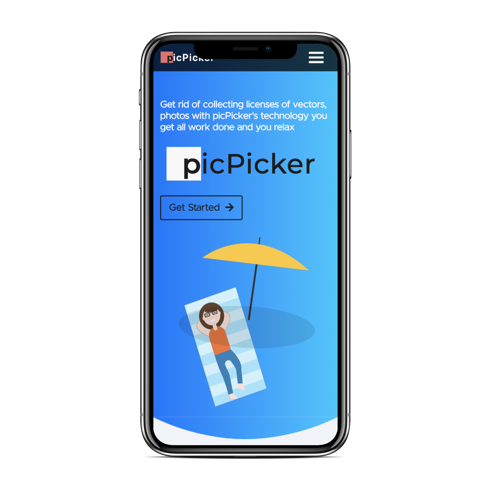

<p align="center"><a href="http://www.codechefvit.com" target="_blank"></a>
</p>

<h1 align = "center">
<span style="color: #1c1c1c; background-color: #fd7470e8; font-weight: 700;">&nbsp; &nbsp;p</span><span
                style="letter-spacing: 1.5px; font-weight: 600; color: black;">icPicker</span></h1>

> <Subtitle>
> With picPicker's Technology get your licensing work for your vector arts, photos etc. downloaded from external Website 

---
[](https://github.com/CodeChefVIT/picPicker/blob/master/README.md) 
  [](https://github.com/CodeChefVIT/picPicker/tree/master/assets)


## Features
- Best in class image search
- Get your licensing work done quick
- Download PDF
- User friendly Website(supported on mobile too)


## Screenshots



## Instructions to run

```
$ git clone https://github.com/CodeChefVIT/picPicker.git
$ cd picPicker
$ pip3 install -r requirements.txt
$ python3 manage.py runserver
```

## Contributors
- <a href="https://github.com/dhairyaostwal/">Dhairya Ostwal</a>
- <a href="https://github.com/rishinpandit09">Rishin Pandit</a>

## License

[](http://badges.mit-license.org)

<p align="center">
	With :heart: by <a href="http://www.codechefvit.com" target="_blank">CodeChef-VIT</a>
</p>
